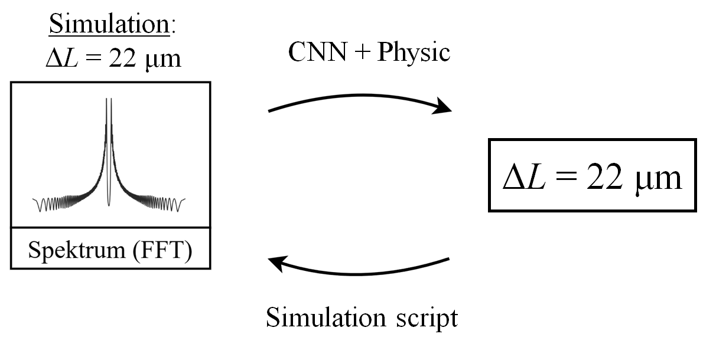
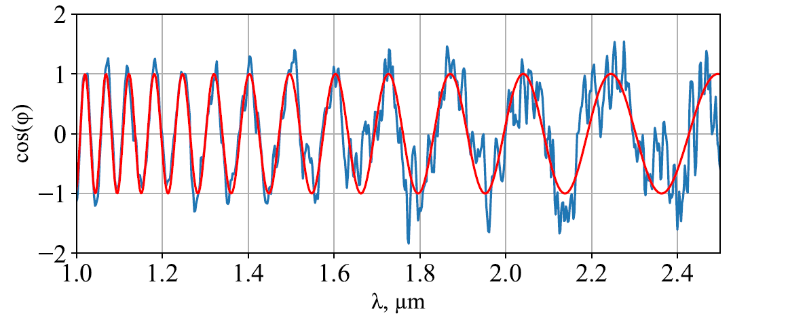
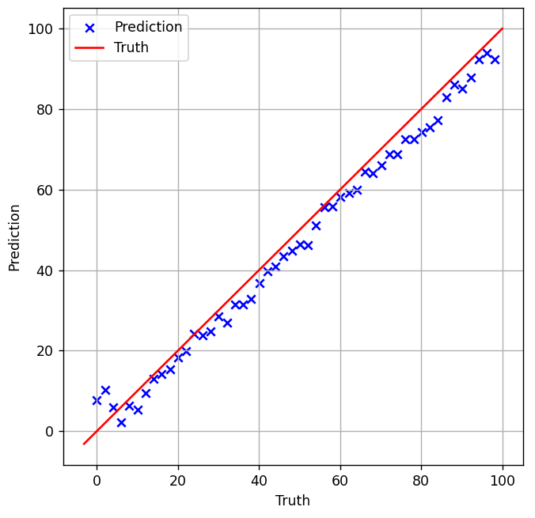

# hybrid-gan-oct-analysis
Project based on my Master's Thesis: «Integrating Deterministic Models into GAN Pipelines for OCT Signal Analysis»

This repository implements a hybrid pipeline of physics + machine-learning for reconstructing a physical parameter (Δ, optical path shift) from interferometric spectra.

## Problem:

A purely ML-based approach to spectral inversion is very sensitive to changes in the physical system and does not generalize when system parameters change.

## Provided solution:

By embedding real physics into the training loop, the network is constrained to learn only physically valid mappings, making it robust to system changes.

  

  <em>Figure 1 - Schema for hybrid Algorithm</em>

## Method:

- Physics-based spectrum generation
- Deep learning (1D CNN)
- Cycle-consistency training (CycleGAN)

## Project structure:

data-generator.py     - Generates interferometric spectra

dataset.py            - PyTorch Dataset + spectrum normalization

models.py             - CNN + physical SpectrumGenerator

train.py              - Training loop

validate.py           - Evaluation & plotting

gan.py                - Paths and evaluation wrapper

spektr/               - Generated spectral files

values/               - Ground truth Δ values

model/                - Saved model weights

requirements.txt

## Launch stages:

pip install -r requirements.txt

python data-generator.py

python train.py 

python validate.py

## Results:

  

  <em>Figure 2 — Simulated OCT interferometer signal with pink + white noise</em>

  

  <em>Figure 3 — Transformation of a simulated signal into a spectrum using the Fourier transform</em>

  

  <em>Figure 4 — The result of training the CNN-network in a loop with a physical spectrum generator</em>

